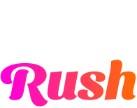

# Color Rush: Desafie Seus Sentidos!

## Sobre o Projeto

Color Rush é um jogo interativo baseado na web, projetado para testar e melhorar suas habilidades de percepção e reação. Neste jogo vibrante e envolvente, os jogadores são desafiados a identificar a bolinha colorida que se destaca das demais, aumentando assim a agilidade mental e a percepção de cores. Perfeito para todas as idades, Color Rush é uma maneira divertida e educativa de passar o tempo, seja sozinho ou competindo contra amigos.

## Características

- **Modos de Jogo Variados**: Escolha entre o Free Mode, para uma experiência relaxante sem pressão de tempo, e o Rush Mode, onde cada acerto reinicia um timer de 5 segundos, adicionando uma camada de intensidade e emoção à jogabilidade.
- **Tema Dinâmico**: Alterne entre temas claros e escuros para uma experiência personalizada, garantindo conforto visual em qualquer ambiente.
- **Desafio Progressivo**: À medida que avança nos níveis, o jogo se torna mais desafiador, testando seus limites e melhorando suas habilidades.
- **Design Intuitivo**: Uma interface limpa e uma experiência de usuário fluida garantem que você possa se concentrar totalmente no jogo.
- **Pontuação e Recordes**: Mantenha o controle da sua pontuação e veja até onde você pode chegar. Tente superar seu recorde pessoal ou desafie amigos para ver quem consegue a maior pontuação.

## Tecnologias Utilizadas

- **React**: Este projeto foi criado com React, aproveitando os hooks para gerenciamento de estado e efeitos, proporcionando uma experiência de usuário responsiva e dinâmica.
- **CSS Modules**: Para um styling eficaz e modular, permitindo uma personalização e manutenção mais fáceis do design do jogo.
- **Local Storage**: Utilizado para armazenar as melhores pontuações dos jogadores, garantindo que os recordes pessoais sejam preservados entre as sessões de jogo.

## Começando

Para experimentar o Color Rush acesso o link do site hospedado no vercel **link do vercel

 Caso o site esteja fora do ar siga estes passos simples:
 
1. **Clone o repositório** para sua máquina local utilizando `git clone https://github.com/seu-usuario/color-rush.git`.
2. **Instale as dependências** rodando `npm install` dentro do diretório do projeto.
3. **Inicie o jogo** com `npm start`. Isso abrirá o jogo no seu navegador padrão.

## Contribua

Contribuições são sempre bem-vindas! Se você tem uma sugestão para melhorar o jogo, sinta-se à vontade para fazer um fork do repositório e enviar um pull request com suas melhorias. Você também pode abrir uma issue para discutir suas ideias com outros contribuidores.

## Licença

Distribuído sob a licença MIT. Veja `LICENSE` para mais informações.

---

Desenvolvido com ❤ por [Seu Nome] em colaboração com o ChatGPT. Explore suas habilidades visuais e reflexos com Color Rush – onde a diversão encontra o desafio.
